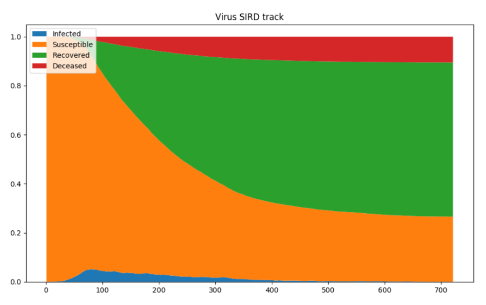
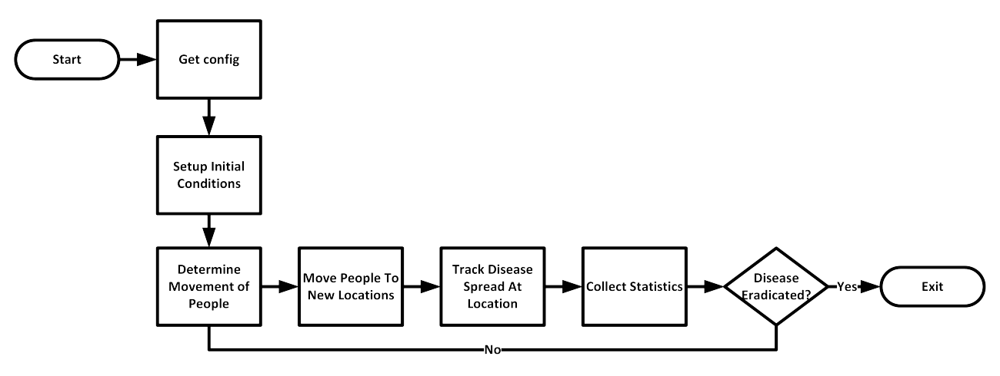
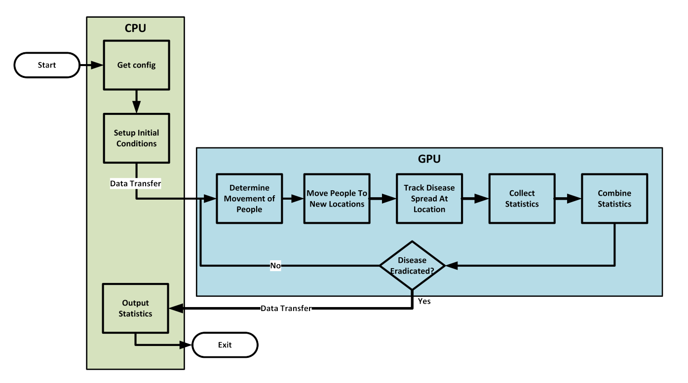

# CORONA
Controlling Outbreak Rates Of Novel Ailments (CORONA): Epidemiological Simulator

## Overview:
In times of global pandemic, simulating the way a disease spreads within a population can provide key data for agencies attempting to come up with policies to control the spread and mitigate the effect. In this paper, we develop a simulation based off of existing Susceptible-Infected-Removed (SIR) simulations focused on tracking disease spread as people move between locations. We then use a GPU to accelerate this simulation utilizing Nvidia’s CUDA tools. With various additional GPU optimizations, we were able to achieve a total 2.45x speedup on the GPU implementation over the baseline CPU implementation.

## Usage:
To build just CPU code:
```
make cpu
```

To build GPU accelerated code:
```
make cuda
```

To build both:
```
make all
```

To run code w/ output:
```
./main <input_file>
./main_cuda <input_file>
```

To plot, pipe output to plot.py:
```
./main <input_file> | ./plot.py
```


## Simulation:
Individual people in the situation are given one of five states, following the S/C/I/R/D model. Susceptible (S) people have not contracted the disease and are able to become infected. Carrier (C) and Infected (I) people are actively infected with the disease, but carriers do not show symptoms. Recovered (R) people have been infected but are both no longer infected and unable to become infected again. Deceased (D) people have died from the disease and are no longer relevant to the simulation.

As these statistics are tracked over a period of time, the following graph can be created: 



## Single Threaded Algorithm:
The core loop of the single-threaded implementation is split into four phases:

• Spread Disease

• Collect Statistics

• Determine Movement

• Execute Movement

In the spread disease step, the simulation loops through each location and determines if an infected individual exists. If so, it will randomly infect other people in that location based on the values provided in the configuration file. The collect statistics step loops through all locations and records the number of people of each infection status. In determine movement, the simulation loops through each location and determines whether each individual there is expected to move. If the individual is expected to move, they are added to a separate list for that location, and if not, they are added to the separate list at their current location. After this has completed (to prevent concurrency issues), these lists’ contents are moved into the population list at each location. Since only a single thread is used, this means that each time step, that thread must visit each person and perform calculations four times. An overview of this algorithm is shown in the following image:



## GPU Accelerated Code:
The main objective of parallelization was to reduce the time spent calculating movement and whether or not an individual was exposed to the disease. We did this by turning every individual in the simulation into their own thread, organized into blocks by their location. This made the most sense, since individuals only interact with others in their same location during each time step. However, since there is no way to predict the number of people in a location at any given time, the block size was determined to be the maximum number of people in any location (which is set statically in the program, unable to be modified by the configuration file). This causes the kernel to allocate significantly more threads than it needs. For example, if locations can hold 256 people, and a population is defined as 200 times the number of locations, an average of 56 threads per block will be unused. However, trying to minimize this overhead will cause extreme slowdowns and control divergence as threads struggle to find open spaces for their respective people to attempt to switch locations. The single-threaded implementation also originally used classes and more complex data types, but these pointers were removed to prevent memory indirection and spatially correlate all the data that was being used.

The new loop structure added additional steps to further segment functions:

• Advance Infection

• Spread Disease

• Collect Statistics

• Combine Statistics

• Determine Movement

• Execute Movement


The spread disease was split into advance infection, which updates the status of people already infected with the disease, and spread disease, which spreads the disease to other people in the same location. Collect statistics was split into collect statistics, where the thread determines the status of its corresponding person, and combine statistics, where these individual tallies are combined together from the various threads to get their final values. 

Further however, there were many iterative steps to improve the performace. This process is explained in the paper. The final GPU Code flowchar is shown below:



## Conclusion
Compared to the initial single-threaded implementation, the parallel implementation and optimizations yielded a 2.45 times speedup. This simulation is not particularly mathematically intensive, but contains significant control complexity. Due to this nature, a multi-threaded CPU implementation would also be worth exploring and may be a better fit for this workload. With this new tool, the world is ready to face the next pandemic if we ever get through the current one.
